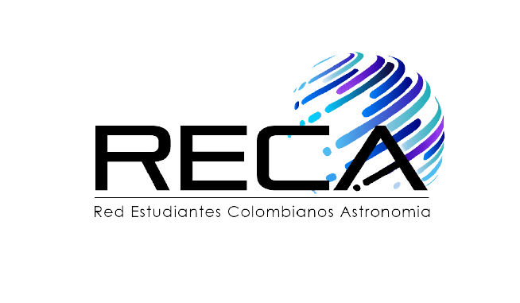

# Bootcamp de programación - Aprendiendo sobre GitHub

Este es un proyecto simple que muestra cómo estructurar un proyecto en Python con pruebas unitarias. Contiene una función que devuelve la frase: "La RECA la construímos entre todos".


## Estructura del Proyecto

```
Bootcamp_AstroPython/
├── src
│   ├── __init__.py
│   └── main.py
├── tests
│   ├── __init__.py
│   └── test_main.py
├── .github
│   └── workflows
│       └── pytest.yml
├── images
│   └── Logo_RECA.png
├── requirements.txt
├── pytest.ini
└── [README.md]
```

## Primeros Pasos

Para comenzar con este proyecto, sigue estos pasos:

1. **Clona el repositorio**:
   ```bash
   git clone https://github.com/yourusername/Bootcamp_AstroPython.git
   cd Bootcamp_AstroPython

   ```

2. **Instala las dependencias necesarias**:
   Se recomienda usar un entorno virtual. Puedes crearlo con `venv`:
   ```bash
   python -m venv venv
   source venv/bin/activate  # En Windows usa: `venv\Scripts\activate`
   ```
   Luego instala las dependencias:
   ```bash
   pip install -r requirements.txt
   ```

3. **Ejecuta la función**:
   Puedes ejecutar la función definida en `src/main.py`  con el siguiente comando: 
   ```bash
   python src/main.py
   ```

4. **Ejecuta las pruebas**:
   Para correr las pruebas, usa el siguiente comando:
   ```bash
   pytest
   ```

## Tutoriales

Este proyecto incluye tutoriales para ayudarte a entender los conceptos básicos:

- [Introducción a Python y Git](tutorials/introduccion_python.md)

## Contribuciones

¡Siéntete libre de hacer un fork del repositorio y enviar pull requests! ¡Todas las contribuciones son bienvenidas!
## Licencia

Este proyecto está licenciado bajo la Licencia MIT. Consulta el archivo LICENSE para más detalles.

